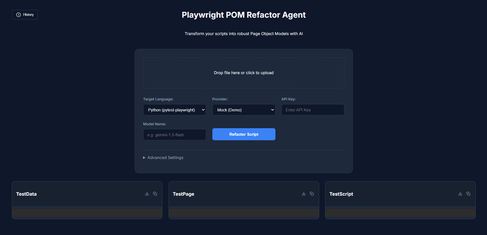
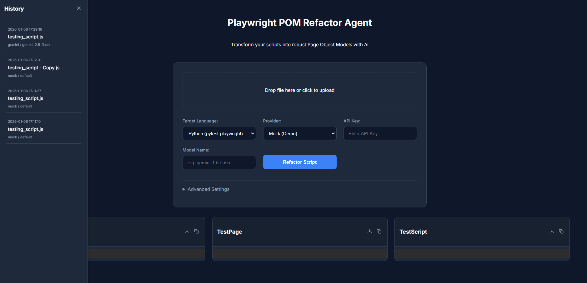
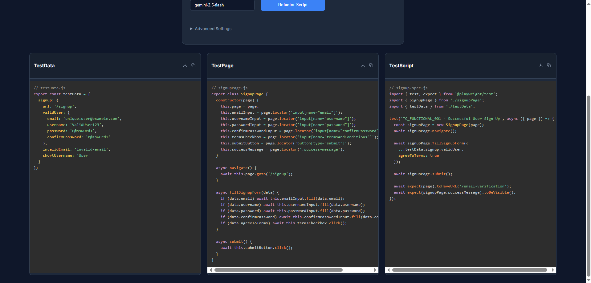

# POMBuilder_Agent - Playwright POM Refactor Agent

**POMBuilder_Agent** is an intelligent agent designed to automatically refactor your Playwright test scripts into the **Page Object Model (POM)** design pattern. By leveraging powerful LLMs (Gemini, Grok, Claude, Ollama), it analyzes your existing scripts and extracts reusable page objects and test data, promoting cleaner, more maintainable test automation code.

## 🚀 Features

*   **Automated Refactoring**: Converts raw Playwright scripts into structured POM files.
*   **Multi-Model Support**: Choose from top-tier LLMs:
    *   Google Gemini
    *   xAI Grok
    *   Anthropic Claude
    *   Ollama (Local LLMs)
*   **Dynamic Configuration**: Input your API keys and Model Names directly in the UI—no hardcoding required.
*   **Instant Preview & Download**: View generated code side-by-side and download files (`TestData`, `TestPage`, `TestScript`) with a single click.
*   **Modern UI**: A sleek, dark-themed interface built for developers.

## 🛠️ Installation

1.  **Clone the repository** (or download the source code):
    ```bash
    git clone <repository-url>
    cd <repository-directory>
    ```

2.  **Create a virtual environment** (recommended):
    ```bash
    python -m venv venv
    # Windows
    venv\Scripts\activate
    # macOS/Linux
    source venv/bin/activate
    ```

3.  **Install dependencies**:
    ```bash
    pip install -r requirements.txt
    ```

## 🏃‍♂️ Usage

1.  **Start the application**:
    ```bash
    python app.py
    ```

2.  **Open your browser**:
    Navigate to `http://127.0.0.1:5000`.

3.  **Refactor a Script**:
    *   **Upload**: Drag and drop your `.js` or `.ts` Playwright script.
    *   **Configure**: Select your desired LLM Provider.
        *   *Optional*: Enter your API Key and a specific Model Name (e.g., `gemini-2.5-flash`).
        *   *Note*: If fields are left empty, it may try to use environment variables or default to a Mock mode.
    *   **Run**: Click **Refactor Script**.
    *   **Export**: Copy the code or click the **Download** icon to save the generated files.

## 🔑 API Keys

To use the real AI capabilities, you will need API keys from the respective providers:

*   **Gemini**: [Google AI Studio](https://aistudio.google.com/)
*   **Grok**: [xAI Console](https://console.x.ai/)
*   **Claude**: [Anthropic Console](https://console.anthropic.com/)
*   **Ollama**: Ensure [Ollama](https://ollama.com/) is running locally (`ollama serve`).


## Snapshots & Demo







<!-- Demo video -->
<video controls width="800">
  <source src="static/images/POMBuilder_Agent.mp4" type="video/mp4">
  Your browser does not support the video tag.
</video>

[Download the demo video](static/images/POMBuilder_Agent.mp4)

## 📚 Project Wiki

Extended documentation and guides live in the repository's `wiki/` folder:

- [Home](wiki/Home.md)
- [Installation](wiki/Installation.md)
- [Usage](wiki/Usage.md)
- [Demo](wiki/Demo.md)
- [API Keys](wiki/API_Keys.md)
- [Contributing](wiki/Contributing.md)
- [FAQ](wiki/FAQ.md)
- [Changelog](wiki/Changelog.md)

## 🤝 Contributing

Contributions are welcome! Please feel free to submit a Pull Request.